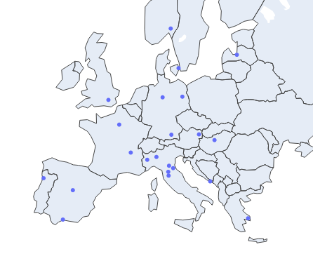
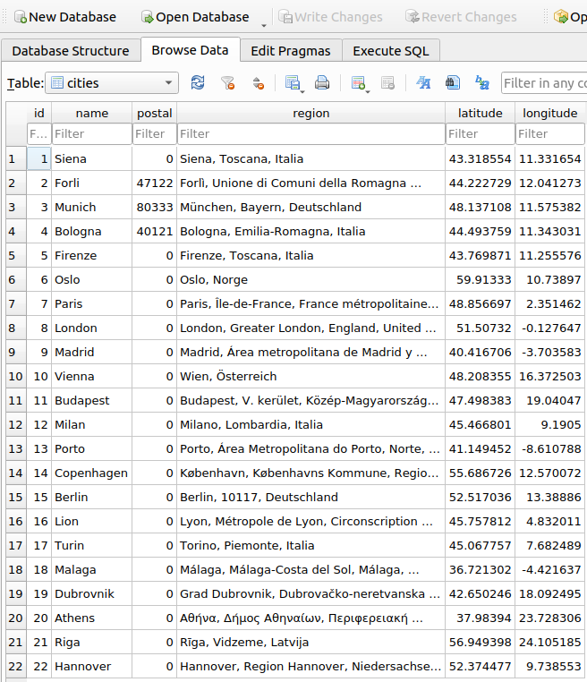

# The Great C++ & Python Ros Example

Catkin build status:

[](https://github.com/vignif/ros-example/actions)

This repository wants to explore with a practical approach the paradigms in the middleware ROS (Robotic Operating System) while connecting ROS with external functionalities.

A script can render a map with a marker per each city in the database.



The information in the database can be explored with a software like [sqlite browser](https://sqlitebrowser.org/) obtaining something like:



Note most of the postal entries are zero, this is due to the design of the api which is not returning the postal code. The value can be stored via providing it as input in a ros message.

## Information flow
1. When launching the main script `roslaunch geo_manager Manager.launch`
- A database is created (if doesn't exist) and filled with proper table schema
- A json file is parsed and is propagated as an api request. The api response is handled and stored in the db.
2. The following nodes are running
- `geo_manager`
- `api_handler`
3. The user or a node can request to add a new city to the database via the topic `/RTCreateCity` with:

```
rostopic pub /RTCreateCity geo_manager/RTCityReq "city_name: 'New York'
postal: 10001"
```
4. Visualize in a browser the cities in contained in the database with `rosrun show show.py`

## Outside ROS
The project also contains:
- the data management of an SQL database using [SQLite3](https://www.sqlite.org/)
- A JSON parser implemented using a cpp library [json](https://github.com/open-source-parsers/jsoncpp)
- Interface to a remote API [nominatim](https://nominatim.openstreetmap.org)

## How to install
Given your catkin workspace `~/ros_ws`, clone the current repository with:

```
git clone git@github.com:vignif/ros-example.git src
```

Check that your system has all the dependencies needed for the project with:

```
rosdep install --from-paths src --ignore-src -r -y
```

Build the project with catkin using:

```
catkin build
```

## How to run

Now that everything is built on your machine, you need to source the binaries with:

in case you are using bash
```
source ~/ros_ws/devel/setup.bash
```

in case you are using zsh
```
source ~/ros_ws/devel/setup.zsh
```

Now you can fire the two main nodes with:
```
roslaunch geo_manager Manager.launch
```

If you want to change the name of your database you can modify the entry of the `Manager.launch` file containing the db name.
The schema of the table `cities` is fixed and is managed with the object `Manager`.

## Unit Tests
Run the unit tests using the [Catkin Command Line Tools](http://catkin-tools.readthedocs.io/en/latest/index.html#)

```
catkin build geo_manager --no-deps --verbose --catkin-make-args run_tests
```

## Versioning

We use [SemVer](http://semver.org/) for versioning. For the versions available, see the [tags on this repository](https://github.com/vignif/ros-example/tags). 


## License

[](http://badges.mit-license.org)

**[MIT license](http://opensource.org/licenses/mit-license.php)**
- Copyright 2021 © Francesco Vigni